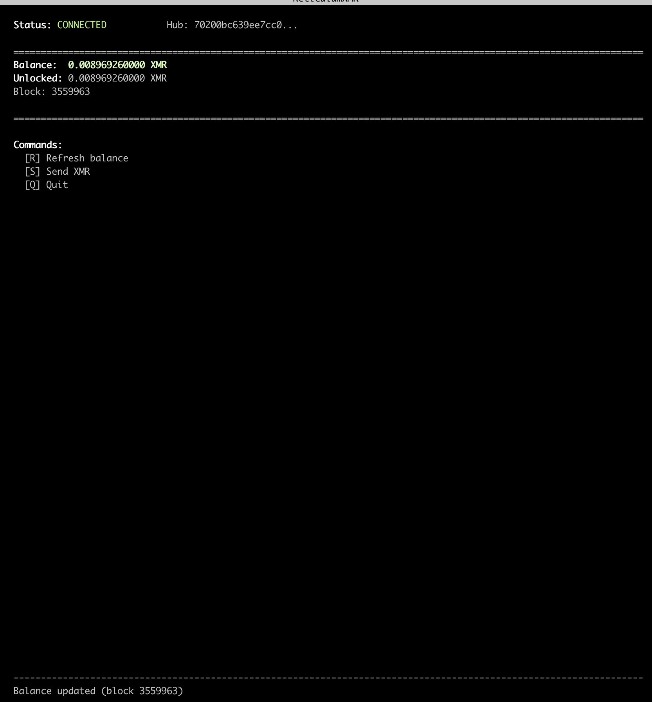

# ReticulumXMR

**Monero transactions over Reticulum networks**

ReticulumXMR enables Monero balance queries and transactions when you don't have direct internet access. Using the [Reticulum Network Stack](https://reticulum.network/), you can check balances and broadcast transactions over any transport Reticulum supports - including radio links, I2P, or local networks.

> **Current Status:** Balance queries work reliably. Transaction signing requires [proper cold wallet setup](#critical-cold-wallet-setup) - see details below.



## Why Use This?

This is **not** a replacement for normal Monero usage. Use ReticulumXMR when:

| Scenario | Why ReticulumXMR |
|----------|------------------|
| You're off-grid with only radio connectivity | Hub with internet relays your transactions |
| Internet is down but local network works | Reach a hub via TCP/LAN |
| You want to avoid direct internet for transactions | Route through I2P or other anonymizing transport |
| Remote community with one internet connection | Share blockchain access via Reticulum |

**The tradeoff:** You need a hub operator you trust with your view key (they can see your balance but cannot spend your funds).

## How It Works

```
YOU (No Internet)                    HUB (Has Internet)
┌────────────────┐                   ┌────────────────┐
│ Your Device    │                   │ Raspberry Pi   │
│                │   Reticulum       │                │
│ - Full wallet  │◄─────────────────►│ - monerod      │
│ - Spend key    │   (Radio/I2P/     │ - wallet-rpc   │
│ - Signs tx     │    TCP/etc)       │ - View-only    │
│                │                   │   wallet       │
└────────────────┘                   └───────┬────────┘
                                             │
                                             ▼
                                     ┌────────────────┐
                                     │ Monero Network │
                                     └────────────────┘
```

**Cold Signing Workflow:**
1. You request your balance → Hub queries view-only wallet → Returns balance
2. You request a transaction → Hub creates unsigned tx → You sign locally with your spend key
3. You send signed tx to hub → Hub broadcasts to Monero network → Returns confirmation

Your private keys **never leave your device**.

## Privacy

| Component | What It Knows |
|-----------|---------------|
| **Your device** | Everything (you control the spend key) |
| **Hub** | Your balance and transaction history (view key) |
| **Reticulum transport** | Nothing (end-to-end encrypted) |
| **Monero network** | Standard Monero privacy applies |

The hub operator can see your balance but **cannot spend your funds**.

## Requirements

**Hub (the device with internet):**
- Raspberry Pi or similar (ARM64 or x86_64)
- 50+ GB storage for pruned blockchain
- Internet connection
- Synced `monerod`
- `monero-wallet-rpc` (v0.18.x)
- Python 3.9+
- Reticulum (`pip install rns`)

**Client (your device):**
- Any device running Python 3.9+
- `monero-wallet-rpc` (v0.18.x)
- Reticulum connectivity to the hub
- Your Monero wallet file

## Setup: Hub

### Step 1: Install Monero

Download from https://getmonero.org/downloads/ or build from source.

```bash
# Example for Linux ARM64 (Raspberry Pi)
wget https://downloads.getmonero.org/cli/linuxarm8
tar xjf linuxarm8
cd monero-aarch64-linux-gnu-*
```

### Step 2: Sync the blockchain

```bash
./monerod --data-dir ~/.bitmonero --prune-blockchain
```

Wait for full sync (can take hours/days depending on connection).

### Step 3: Create a view-only wallet

You need the **view key** from the wallet you want to monitor. On the client machine where your full wallet exists:

```bash
./monero-wallet-cli --wallet-file your-wallet
Password: ****
[wallet]: address
# Copy the primary address
[wallet]: viewkey
# Copy the secret view key (64 hex characters)
```

On the hub, create the view-only wallet:

```bash
./monero-wallet-cli --generate-from-view-key hub_viewonly
# Enter the address when prompted
# Enter the view key when prompted
# Set a password (can be empty for RPC access)
# Set restore height (block height when wallet was created, or 0 to scan all)
```

### Step 4: Start wallet-rpc on hub

```bash
./monero-wallet-rpc \
    --daemon-address 127.0.0.1:18081 \
    --rpc-bind-port 18085 \
    --disable-rpc-login \
    --wallet-dir /path/to/wallet/directory
```

Open the view-only wallet:
```bash
curl -X POST http://127.0.0.1:18085/json_rpc \
    -H 'Content-Type: application/json' \
    -d '{"jsonrpc":"2.0","id":"0","method":"open_wallet","params":{"filename":"hub_viewonly","password":""}}'
```

### Step 5: Install ReticulumXMR

```bash
git clone https://github.com/LFManifesto/ReticulumXMR.git
cd ReticulumXMR
python3 -m venv venv
source venv/bin/activate
pip install -e .
```

### Step 6: Configure Reticulum

Edit `~/.reticulum/config` to add interfaces. Example for TCP server:

```ini
[reticulum]
  enable_transport = True

[[TCP Server]]
  type = TCPServerInterface
  enabled = yes
  listen_ip = 0.0.0.0
  listen_port = 4242
```

Start Reticulum:
```bash
rnsd
```

### Step 7: Start the hub

```bash
source venv/bin/activate
python -m reticulumxmr.hub
```

The hub outputs its **destination hash** - clients need this to connect:
```
Destination: <70200bc639ee7cc0f385d6d4ca1c4afd>
```

## Setup: Client

### Step 1: Install Monero wallet-rpc

Same as hub - download from https://getmonero.org/downloads/

### Step 2: Start wallet-rpc with your full wallet

```bash
./monero-wallet-rpc \
    --wallet-file /path/to/your-wallet \
    --rpc-bind-port 18083 \
    --disable-rpc-login \
    --daemon-address 127.0.0.1:18081  # or remote node
```

Note: The client wallet-rpc needs daemon access for signing. You can use a remote node or skip this if only checking balance.

### Step 3: Install ReticulumXMR

```bash
git clone https://github.com/LFManifesto/ReticulumXMR.git
cd ReticulumXMR
python3 -m venv venv
source venv/bin/activate
pip install -e .
```

### Step 4: Configure Reticulum

Edit `~/.reticulum/config` to connect to the hub:

```ini
[[Hub Connection]]
  type = TCPClientInterface
  enabled = yes
  target_host = <hub-ip-address>
  target_port = 4242
```

For radio interfaces, see [Reticulum documentation](https://reticulum.network/manual/).

Start Reticulum:
```bash
rnsd
```

### Step 5: Connect to hub

**Option A: TUI (recommended)**

```bash
source venv/bin/activate
reticulumxmr-tui <hub-destination-hash>
```

The TUI provides an interactive interface for checking balance and sending transactions. Controls:
- `R` - Refresh balance
- `S` - Send XMR (prompts for address and amount)
- `Q` - Quit

**Option B: CLI commands**

```bash
source venv/bin/activate

# Check balance
python -m reticulumxmr.client <hub-destination-hash> balance

# Send XMR (requires wallet-rpc running with full wallet)
python -m reticulumxmr.client <hub-destination-hash> send <recipient-address> <amount>
```

## Example Session

**Balance Query (verified working):**
```bash
$ python -m reticulumxmr.client 70200bc639ee7cc0f385d6d4ca1c4afd balance
Balance: 0.008969260000 XMR
Unlocked: 0.008969260000 XMR
Block height: 3559948
```

**Sending XMR (requires proper cold wallet setup):**
```bash
$ python -m reticulumxmr.client 70200bc639ee7cc0f385d6d4ca1c4afd send 4Bxxx... 0.001
# Only works if cold wallet pair was set up correctly from the start
# See "CRITICAL: Cold Wallet Setup" section
```

## Usage Workflow

**Recommended setup: Two terminal windows**

```
┌─────────────────────────────────┬─────────────────────────────────┐
│  Terminal 1: Communication      │  Terminal 2: Transactions       │
├─────────────────────────────────┼─────────────────────────────────┤
│                                 │                                 │
│  $ nomadnet                     │  $ reticulumxmr-tui <hub-hash>  │
│                                 │                                 │
│  - Exchange addresses via LXMF  │  - Check balance                │
│  - Coordinate with peers        │  - Send XMR                     │
│  - Monitor network status       │  - View transaction status      │
│                                 │                                 │
└─────────────────────────────────┴─────────────────────────────────┘
```

**Terminal 1 - NomadNet** (optional but recommended):
- Standard Reticulum messaging client
- Exchange Monero addresses securely over encrypted LXMF
- Coordinate payments with other Reticulum users
- Install: `pip install nomadnet`

**Terminal 2 - ReticulumXMR TUI**:
- Connect to your hub and manage XMR
- Press `S` to send, enter address (paste from NomadNet), enter amount
- Press `R` to refresh balance after transactions

**Simpler alternative** - If you don't need peer messaging:
- Just run the TUI: `reticulumxmr-tui <hub-hash>`
- Use CLI for scripting: `python -m reticulumxmr.client <hub-hash> balance`

## Data Transfer Sizes

| Operation | Size | Time @ 1200 bps |
|-----------|------|-----------------|
| Balance query | ~500 B | <1 sec |
| Full transaction | ~8 KB | ~53 sec |

Transactions are feasible over slow radio links.

## Tested Transports

| Transport | Balance Queries | Transaction Signing |
|-----------|-----------------|---------------------|
| TCP/IP | Verified | Requires cold wallet setup |
| I2P | Untested | Untested |
| LoRa (RNode) | Untested | Untested |
| HF Radio | Untested | Untested |

## CRITICAL: Cold Wallet Setup

**Transaction signing requires a proper cold wallet pair created from the start.** You cannot retrofit cold signing onto an existing wallet.

### Why This Matters

Monero's cold signing workflow requires:
1. Cold wallet created FIRST (offline, has spend key)
2. View-only wallet derived FROM the cold wallet (on hub)
3. They must share synchronized cryptographic state from creation

**If you:**
- Already have a wallet and want to add a view-only copy → Cold signing will NOT work
- Create a fresh wallet pair from scratch → Cold signing WILL work

### Setting Up a Proper Wallet Pair

**Step 1: Create cold wallet on client (offline machine)**
```bash
./monero-wallet-cli --generate-new-wallet cold_wallet --offline
# Save the mnemonic seed securely
# Note the address and view key
```

**Step 2: Create view-only wallet on hub**
```bash
./monero-wallet-cli --generate-from-view-key hub_viewonly
# Enter the address from cold wallet
# Enter the view key from cold wallet
# Set restore height to current block height
```

**Step 3: Fund the new wallet**
Send funds to the new wallet address. Wait for confirmations.

**Step 4: Export/import outputs**
```bash
# On hub (view-only): export outputs
curl -X POST http://127.0.0.1:18085/json_rpc -d '{"jsonrpc":"2.0","id":"0","method":"export_outputs","params":{"all":true}}'

# On client (cold): import outputs
curl -X POST http://127.0.0.1:18083/json_rpc -d '{"jsonrpc":"2.0","id":"0","method":"import_outputs","params":{"outputs_data_hex":"<from above>"}}'
```

Now cold signing will work correctly.

## Limitations

- Hub operator can see your balance (but cannot spend)
- Requires view key sharing with hub
- **Cold signing requires proper wallet pair setup (see above)**
- Client needs wallet-rpc in offline mode for transaction signing
- Not suitable for high-frequency trading

## Roadmap

- [x] Balance queries (verified over TCP)
- [x] TUI interface
- [ ] Transaction signing (code complete, requires proper wallet setup)
- [ ] LoRa testing
- [ ] HF radio testing
- [ ] I2P testing
- [ ] Multi-wallet hub support

## License

MIT License

## Links

- [Reticulum Network Stack](https://reticulum.network/)
- [Monero Project](https://getmonero.org/)
- [Light Fighter Manifesto](https://lightfightermanifesto.org/)
